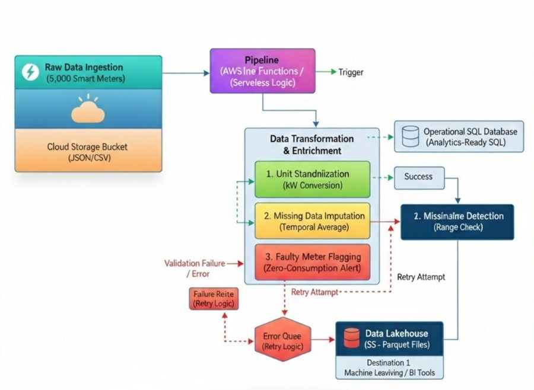

## GreenStream Energy – ETL Case Study

### Introduction

This task applies design thinking principles to a real-world data science problem.
The focus is on designing a clear and logical ETL pipeline that transforms raw energy data into reliable, analytics-ready datasets, without focusing on cloud-specific implementation details.

## 1. Case Study Background

GreenStream Energy is a smart-utility provider that collects electricity usage data from 50,000 households using smart meters. Although large volumes of data are continuously collected, the data is currently stored as raw operational data without being transformed into actionable insights.

The company aims to:

* Identify peak energy consumption periods
* Detect abnormal or faulty smart meters
* Prepare data for future predictive analytics and forecasting

To support these goals, GreenStream Energy plans to design an automated, serverless ETL pipeline that transforms raw data into analytics-ready datasets.

## 2. Task A: ETL Architecture Diagram

### Conceptual System Design

### Overall Data Flow Description

1. Smart meters upload electricity usage data in CSV format.
2. CSV files are stored in a raw data storage layer that acts as a landing zone while preserving the original data for auditing and reprocessing.
3. An orchestration layer automatically triggers the ETL workflow when new data arrives.
4. The orchestration layer is responsible for execution monitoring, retry handling, and failure tracking.
5. The transformation layer cleans, standardizes, and validates the data according to defined business rules.
6. Valid records are stored in a structured relational database for querying and validation purposes.
7. Validated data is converted into Parquet format and archived in an analytics storage layer optimized for long-term analysis.
8. Failed records are logged, retried automatically, and isolated for manual inspection if failures persist.

## 3. Task B: Transformation Logic & Business Rules Design

### Unit Standardization

* If the energy unit is Watts (W), the value is divided by 1000 and converted to Kilowatts (kW).
* All output records must use kW as the standard measurement unit.

### Missing Values Handling

* If an energy reading is NULL, the record is flagged as incomplete.
* Incomplete records are excluded from peak energy consumption calculations.
* Missing values are preserved for auditing purposes and are not silently removed.

### Data Validation

* Energy consumption values must be non-negative.
* Timestamps must be valid and cannot be set in the future.
* Meter IDs must follow the expected format and cannot be missing.

### Faulty Meter Detection (Basic Logic)

* Continuous zero consumption over an unusually long period flags a meter as potentially faulty.
* Abnormal consumption spikes exceeding realistic thresholds are flagged for investigation.
* Faulty meters are flagged rather than deleted to maintain data traceability.

## 4. Task C: Single Record Lifecycle Explanation

1. A smart-meter record is uploaded as part of a CSV file and stored unchanged in the raw data storage layer.
2. The arrival of the file automatically triggers the ETL orchestration process.
3. The transformation layer applies unit conversion, missing value handling, and data validation rules.
4. If the record passes all validation checks, it is stored in a structured relational database.
5. The validated record is converted into Parquet format and archived for analytics and future forecasting.
6. If the record fails at any stage, errors are logged, retries are attempted automatically, and persistent failures are isolated for review.

## Conclusion

This conceptual ETL design ensures data quality, reliability, and analytics readiness.
By preserving raw data, applying clear transformation rules, and supporting failure handling, the pipeline prepares GreenStream Energy’s data for reporting, forecasting, and future machine learning applications.
